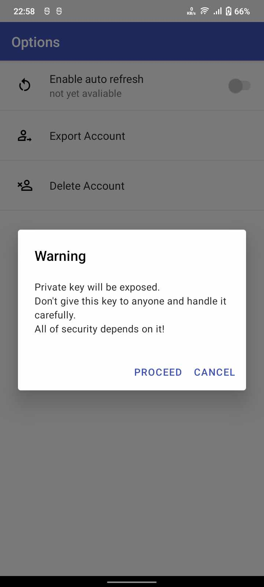

# Public-Board
### Public Board is moblie app used for private and secure communication
The app uses React Native for frontend and django for backend. All messages in system are publicly avaliable however
each of them is encrypted with combination of RSA and AES encryption. 

## Screenshots from app

<table>
  <tr>
    <td></td>
    <td></td>
    <td></td>
  </tr>
    <tr>
    <td></td>
    <td></td>
    <td></td>
  </tr>
</table>


## Instalation
### Android app
To build and install mobile app go to the **PublicBoard** folder and run following commands
```
npm ci
npx react-native run-android
```
You might need to edit **src/app/utils/api-url.json** url key to connect to your backend

### Server app
To run server first go to **django** folder and configure it by running:
```
pip install -r code/requirements.txt
python code/manage.py makemigrations
python code/manage.py migrate
python code/manage.py createsuperuser
```
Then configure your address by chaning **ALLOWED_HOSTS** inside **code/mysite/settings.py** 

After that you can start server by running
```
python code/manage.py runserver
```

If docker container is used instad last command run
```
docker-compose build
docker-compose up
```